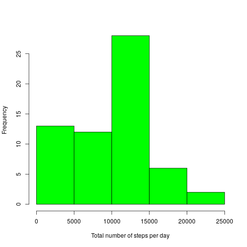
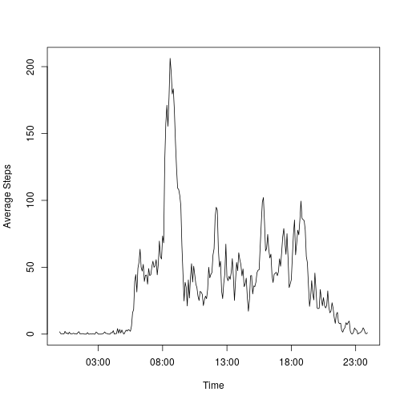
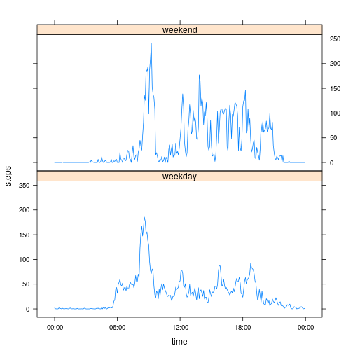

Assignment week 2 Reproducible Ressearch 
========================================

### Loading and preprocessing the data

The source of the data is (https://d396qusza40orc.cloudfront.net/repdata%2Fdata%2Factivity.zip) [52K]

The variables included in this dataset are:

* **steps**: Number of steps taking in a 5-minute interval (missing
    values are coded as `NA`)

* **date**: The date on which the measurement was taken in YYYY-MM-DD
    format

* **interval**: Identifier for the 5-minute interval in which
    measurement was taken

For this assigment it is assumed the data file is already dowloaded. Therfore the file can be direclty unzipped. The interval column is converted to a four digit number format:


```r
unzip("./activity.zip")
activity <- read.csv("./activity.csv")
activity$interval <- unlist(lapply(activity$interval, function(x) {paste(strrep("0",4 - nchar(x)),x,sep="")}))
head(activity)
```

```
##   steps       date interval
## 1    NA 2012-10-01     0000
## 2    NA 2012-10-01     0005
## 3    NA 2012-10-01     0010
## 4    NA 2012-10-01     0015
## 5    NA 2012-10-01     0020
## 6    NA 2012-10-01     0025
```

## What is mean total number of steps taken per day?
### 1. Calculate the total number of steps taken per day

This can be done by taking the sum if the steps column for each date: 


```r
day_steps_total <- aggregate(activity$steps,list(activity$date),sum,na.rm = TRUE)
head(day_steps_total)
```

```
##      Group.1     x
## 1 2012-10-01     0
## 2 2012-10-02   126
## 3 2012-10-03 11352
## 4 2012-10-04 12116
## 5 2012-10-05 13294
## 6 2012-10-06 15420
```


### 2. Make a histogram of the total number of steps taken each day 

Plotting the data of the previous step:
 

```r
hist(day_steps_total$x, col = "Green", xlab ="Total number of steps per day",main="")
```



### 3. Calculate and report the mean and median of the total number of steps taken per day

Aggregate the data similar to step one to calculate the mean and median. Both dataframes are merged to one table


```r
day_steps_mean <- aggregate(activity$steps,list(activity$date),mean,na.rm = TRUE)
day_steps_median <- aggregate(activity$steps,list(activity$date),median,na.rm = TRUE)
merged <- merge(day_steps_mean,day_steps_median,by="Group.1")
names(merged) <- c("Date","Mean","Median")
head(merged)
```

```
##         Date     Mean Median
## 1 2012-10-01      NaN     NA
## 2 2012-10-02  0.43750      0
## 3 2012-10-03 39.41667      0
## 4 2012-10-04 42.06944      0
## 5 2012-10-05 46.15972      0
## 6 2012-10-06 53.54167      0
```

## What is the average daily activity pattern?
This can be evaluted by plotting the averge steps per time stamp:


```r
time_steps_mean <- aggregate(activity$steps,list(activity$interval),mean,na.rm = TRUE)
plot(strptime(time_steps_mean$Group.1, format="%H%M"),time_steps_mean$x, xlab="Time", ylab="Average Steps", type="l")
```



The daily paterns shows a hight activity around 08:00 and medium activity for the rest of the day until 20:00

## Inputting missing values
### 1. Calculate and report the total number of missing values in the dataset?)

This can be done wiht the following code:


```r
nrow(activity[is.na(activity$steps),])
```

```
## [1] 2304
```

### 2. Devise a strategy for filling in all of the missing values in the dataset.
The stratgey is to replace al NA's with zeros

### 3. Create a new dataset that is equal to the original dataset but with the missing data filled in.

```r
activity_noNA <- replace(activity, is.na(activity), 0)
head(activity_noNA)
```

```
##   steps       date interval
## 1     0 2012-10-01     0000
## 2     0 2012-10-01     0005
## 3     0 2012-10-01     0010
## 4     0 2012-10-01     0015
## 5     0 2012-10-01     0020
## 6     0 2012-10-01     0025
```

### 4a.Make a histogram of the total number of steps taken each day 
Again the histogram can be plotted as follows: 


```r
day_steps_total_noNA <- aggregate(activity_noNA$steps,list(activity_noNA$date),sum,na.rm = TRUE)
hist(day_steps_total_noNA$x, col = "Green", xlab ="Total number of steps per day",main="")
```


### 4b. Calculate and report the mean and median total number of steps taken per day
Similarly to the dataset with the NA's


```r
day_steps_mean_noNA <- aggregate(activity_noNA$steps,list(activity_noNA$date),mean,na.rm = TRUE)
day_steps_median_noNA <- aggregate(activity_noNA$steps,list(activity_noNA$date),median,na.rm = TRUE)
merged_noNA <- merge(day_steps_mean_noNA,day_steps_median_noNA,by="Group.1")
names(merged_noNA) <- c("Date","Mean","Median")
head(merged_noNA)
```

```
##         Date     Mean Median
## 1 2012-10-01  0.00000      0
## 2 2012-10-02  0.43750      0
## 3 2012-10-03 39.41667      0
## 4 2012-10-04 42.06944      0
## 5 2012-10-05 46.15972      0
## 6 2012-10-06 53.54167      0
```

### 4c. Do these values differ from the estimates from the first part of the assignment? 
Because NA are replaced with zeros the total(sum) stay the same. The replacement does have effect on the mean and medium. This effect is marginal due to the fact that a day often has only NAs or no NAs at all

## Are there differences in activity patterns between weekdays and weekends?
### 1. Create a new factor variable in the dataset with two levels – “weekday” and “weekend”.

To do this the lapply function can be used with a inlince function which makes a distinction between weekday and weekend days based on the date provided: 

```r
activity_noNA$weekday <- unlist(lapply(as.Date(activity_noNA$date,format = "%Y-%m-%d"), function(x){
                                                      if (weekdays(x, abbreviate=TRUE) =='za'| weekdays(x)=='zo')
                                                      {result <- "weekend"} 
                                                      else{ result <- "weekday"}}
                         ))    
head(activity_noNA)
```

```
##   steps       date interval weekday
## 1     0 2012-10-01     0000 weekday
## 2     0 2012-10-01     0005 weekday
## 3     0 2012-10-01     0010 weekday
## 4     0 2012-10-01     0015 weekday
## 5     0 2012-10-01     0020 weekday
## 6     0 2012-10-01     0025 weekday
```

### 2. Maken a pannel plot
This can be done by aggregating the data and using the lattice package for plotting


```r
time_weekday_steps_mean <- aggregate(activity_noNA$steps,list(activity_noNA$interval,activity_noNA$weekday),mean)
names(time_weekday_steps_mean) <- c("time","weekday","steps")
time_weekday_steps_mean$time <- as.POSIXct(time_weekday_steps_mean$time, format="%H%M")

library(lattice)
xyplot(steps ~ time | weekday, data = time_weekday_steps_mean,layout = c(1,2), type="l", scale = list(x=list(format = "%H:%M")))
```




